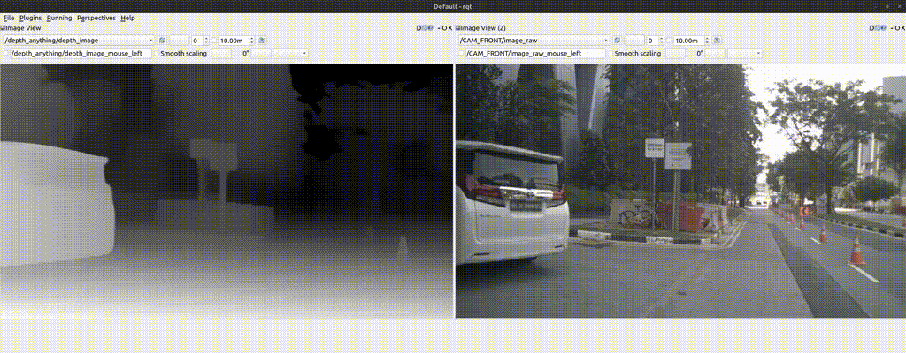

# Real-Time Steering Angle Estimation via Monocular Depth Profiling and 1D Free-Space Analysis

This project implements a real-time steering angle estimation system using monocular depth estimation and 1D free-space analysis. The system processes video input from a camera, generates depth maps using the Depth-Anything-V2 model, and computes optimal steering angles based on free-space detection in the scene.



## Project Overview

This system provides a lightweight approach to autonomous steering guidance by:

1. Using monocular depth estimation to perceive the environment without requiring expensive LiDAR or stereo camera setups
2. Implementing a 1D free-space analysis algorithm that efficiently identifies navigable paths
3. Computing optimal steering angles in real-time based on depth profiles and free-space detection

The approach is particularly useful for:
- Autonomous vehicle navigation in unstructured environments
- Driver assistance systems
- Mobile robotics applications
- Educational demonstrations of depth-based navigation

## Key Features

- **Monocular Depth Estimation**: Utilizes the Depth-Anything-V2 model to generate high-quality depth maps from single RGB images
- **Region of Interest (ROI) Processing**: Focuses analysis on the relevant portion of the frame (typically the lower section containing the drivable area)
- **1D Free-Space Analysis**: Computes a 1D profile of free space by analyzing depth information along the horizontal axis
- **Real-Time Processing**: Optimized for real-time performance on various hardware platforms (CPU, CUDA, MPS)
- **Streamlit Visualization**: Interactive web interface for visualizing depth maps, free-space profiles, and steering recommendations
- **Configurable Parameters**: Adjustable ROI, camera parameters, and model selection

## Technical Approach

### Depth Estimation

The system uses the Depth-Anything-V2 model, which is based on the DINOv2 vision transformer architecture. This model provides high-quality depth maps from monocular RGB images without requiring specific training for the target environment.

### Free-Space Analysis

The free-space analysis follows these steps:

1. **ROI Selection**: Define a region of interest in the lower portion of the frame where drivable areas are likely to appear
2. **Depth Profiling**: Generate a depth map for the ROI
3. **1D Profile Generation**: Sum the depth values along each vertical column to create a 1D profile
4. **Cost Inversion**: Invert the depth profile so that higher values represent more navigable areas
5. **Trajectory Computation**: Identify the safest path by finding the maximum value in the inverted profile
6. **Steering Angle Calculation**: Convert the column position of the optimal path to a steering angle based on the camera's field of view

## System Components

### Core Modules

- `depth_anything_v2/`: Implementation of the Depth-Anything-V2 model
- `realtimesteer.py`: Main implementation of the RealTimeSteeringDetector class
- `streamlit_app.py`: Interactive web interface for visualizing the system
- `rtds.py`: Additional utilities for real-time depth sensing

### Dependencies

- PyTorch and TorchVision for deep learning
- OpenCV for image processing
- Streamlit for the web interface
- Matplotlib for visualization
- NumPy for numerical operations

## Installation

1. Clone the repository:
```bash
git clone https://github.com/yourusername/Real-Time-Steering-Estimation.git
cd Real-Time-Steering-Estimation
```

2. Install dependencies:
```bash
pip install -r requirements.txt
```

3. Download the pre-trained Depth-Anything-V2 model weights:
```bash
# Download weights for the selected model size (vits, vitb, vitl, or vitg)
# Example for vits (small) model:
wget https://huggingface.co/depth-anything/Depth-Anything-V2/resolve/main/depth_anything_v2_vits.pth
```

## Usage

### Command Line Interface

Run the real-time steering detector:

```bash
python realtimesteer.py
```

This will start the camera feed and display:
- The original video with ROI boundaries
- The computed steering angle
- A visualization of the free-space profile

### Streamlit Web Interface

For a more interactive experience, run the Streamlit app:

```bash
streamlit run streamlit_app.py
```

The web interface provides:
- Live video feed with ROI visualization
- Real-time depth map visualization
- Free-space profile graph
- Adjustable parameters for ROI, camera settings, and model selection

## Configuration

The system can be configured with the following parameters:

- **Model Encoder**: Choose between different sizes of the Depth-Anything-V2 model (vits, vitb, vitl, vitg)
- **ROI Settings**: Adjust the top and bottom fractions of the frame to define the ROI
- **Camera Parameters**: Set sensor width, height, and focal length to calculate accurate field of view
- **Processing Interval**: Control how frequently frames are processed for steering angle estimation

## Performance Considerations

- The smaller model variants (vits, vitb) offer faster inference with slightly reduced depth estimation quality
- Larger models (vitl, vitg) provide higher quality depth maps but require more computational resources
- Processing every frame may not be necessary; the system can be configured to process frames at specific intervals

## Future Work

- Integration with actual steering control systems
- Enhanced trajectory planning using temporal information
- Obstacle detection and avoidance
- Multi-frame analysis for improved stability
- Performance optimization for edge devices

## License

This project is licensed under the MIT License - see the LICENSE file for details.

## Acknowledgments

- The Depth-Anything-V2 model is based on research by [Depth-Anything](https://github.com/LiheYoung/Depth-Anything)
- DINOv2 vision transformer architecture by Meta AI Research
